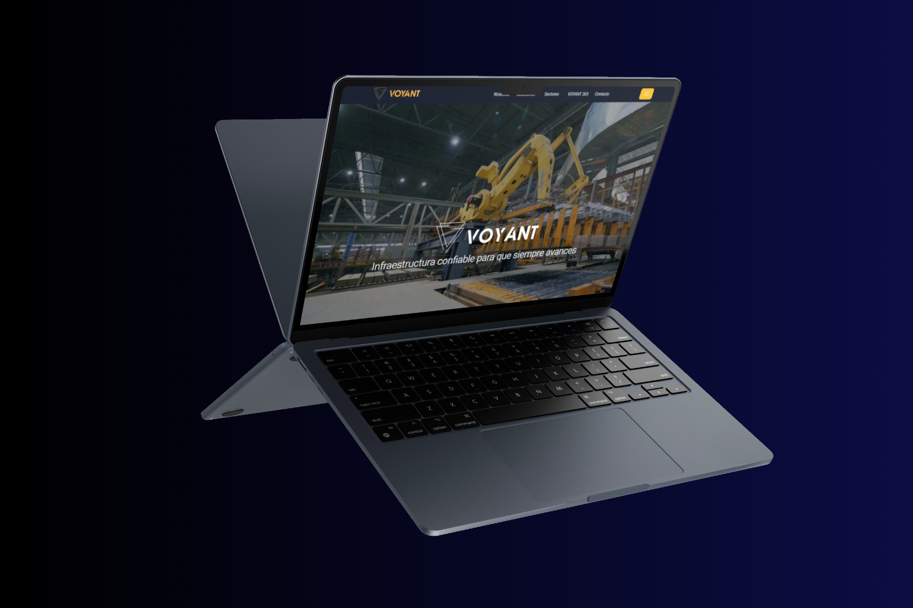

# Web oficial de Sigmasafi

### Características
- Desarrollado con React y Vite.
- Estilización con Tailwind CSS.
- Optimizado para rendimiento.

### Captura de pantalla 



### 🌎 Demo en Vivo

Puedes ver la aplicación desplegada en: [Voyant en Vercel](https://voyant-chi.vercel.app/)

 

# Para empezar

### 1. Clona el repositorio

```bash
# Clona el repositorio
git clone https://github.com/Gitbertod/Voyant

# Ingresa al directorio del proyecto si es necesario
cd voyant

# Instala las dependencias
npm install

# Ejecuta el proyecto
npm run dev